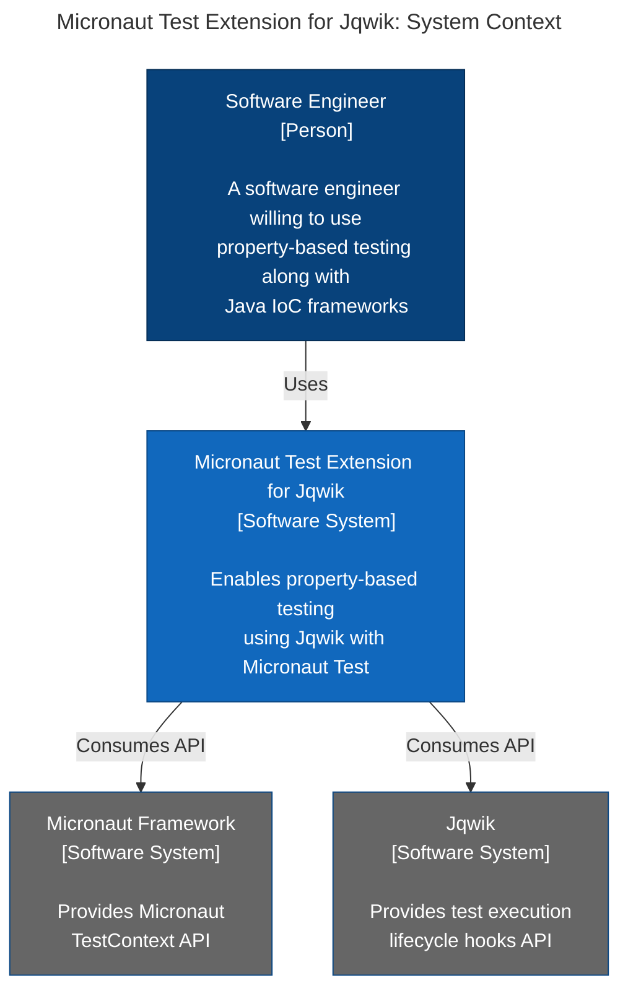

```mermaid
---
title: "Micronaut Test Extension for Jqwik: System Context"
---

flowchart TB
    User["Software Engineer
    [Person]

    A software engineer willing to use
    property-based testing along with
    Java IoC frameworks"]
    
    MTEJ["Micronaut Test Extension for Jqwik
    [Software System]
    
    Enables property-based testing
    using Jqwik with Micronaut Test"]
    
    MF["Micronaut Framework
    [Software System]
    
    Provides Micronaut
    TestContext API"]
    
    JQ["Jqwik
    [Software System]
    
    Provides test execution
    lifecycle hooks API"]
    
    User -- "Uses" --> MTEJ
    MTEJ -- "Consumes API" --> MF
    MTEJ -- "Consumes API" --> JQ
    
    classDef focusSystem fill:#1168bd,stroke:#0b4884,color:#ffffff
    classDef supportingSystem fill:#666,stroke:#0b4884,color:#ffffff
    classDef person fill:#08427b,stroke:#052e56,color:#ffffff
    
    class MTEJ focusSystem
    class User person
    class MF,JQ supportingSystem
    
    click JQ "https://github.com/jqwik-team/jqwik" _blank
    click MTEJ "https://github.com/jqwik-team/jqwik-micronaut" _blank
    click MF "https://micronaut-projects.github.io/micronaut-test/latest/guide" _blank
```