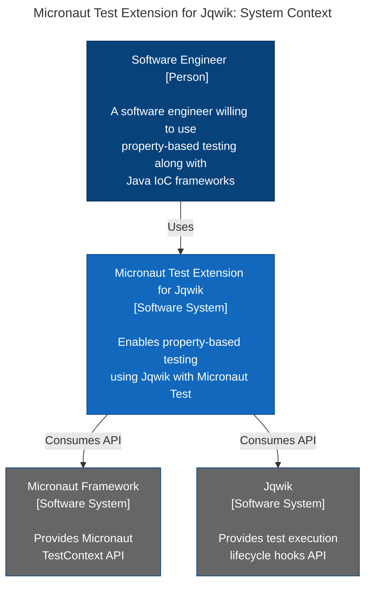

[](https://github.com/jqwik-team/jqwik-micronaut/actions/workflows/gradle.yml)

# Jqwik Micronaut Support

This project provides an extension to support testing of Micronaut applications
with [Jqwik](https://jqwik.net).



### Table of Contents

- [How to Install](#how-to-install)
    - [Gradle](#gradle)
    - [Maven](#maven)
    - [Supported Micronaut Versions](#supported-micronaut-versions)
- [Standard Usage](#standard-usage)
    - [Lifecycle](#lifecycle)
    - [Parameter Resolution of Autowired Beans](#parameter-resolution-of-autowired-beans)
    - [Micronaut JUnit Jupiter Testing Annotations](#micronaut-junit-jupiter-testing-annotations)
- [Shortcomings](#shortcomings)
- [Release Notes](#release-notes)
    - [1.0.0](#100)

## How to Install

### Gradle

Follow the [instructions here](https://jqwik.net/docs/current/user-guide.html#gradle) and add the following dependency to your `build.gradle` file:

```groovy
dependencies {
    implementation("io.micronaut:micronaut-context:3.8.9")
    // ...
    testImplementation("net.jqwik:jqwik-micronaut:1.0.0")
    testImplementation("io.micronaut.test:micronaut-test-core:3.9.2")
}
```

You can look at a [sample project TBD]() using Jqwik, Micronaut and Gradle.

### Maven

Follow the [instructions here](https://jqwik.net/docs/current/user-guide.html#maven) and add the following dependency to your `pom.xml` file:

```xml
<xml>
    <dependency>
        <groupId>io.micronaut</groupId>
        <artifactId>micronaut-context</artifactId>
        <version>3.8.9</version>
    </dependency>

    <!--...-->

    <dependency>
        <groupId>net.jqwik</groupId>
        <artifactId>jqwik-micronaut</artifactId>
        <version>1.0.0</version>
        <scope>test</scope>
    </dependency>

    <dependency>
        <groupId>io.micronaut.test</groupId>
        <artifactId>micronaut-test-core</artifactId>
        <version>3.9.2</version>
        <scope>test</scope>
    </dependency>
</xml>
```

### Supported Micronaut Versions

You have to provide your own version of Micronaut through Gradle or Maven. The _jqwik-micronaut_ library has been tested with versions:

- `3.8.9`.

Please report any compatibility issues you stumble upon.

## Standard Usage

To enable autowiring of a Micronaut application context or beans you just have to add `@JqwikMicronautTest` to your test container class:

```java
import jakarta.inject.Inject;

import net.jqwik.api.ForAll;
import net.jqwik.api.Property;
import net.jqwik.api.constraints.AlphaChars;
import net.jqwik.api.constraints.StringLength;

import org.assertj.core.api.Assertions;

@JqwikMicronautTest
class MyMicronautProperties {
    @Inject
    private MyMicronautBean myMicronaut;

    @Property(tries = 1)
    void nameIsAddedToHello(@ForAll @AlphaChars @StringLength(min = 1) final String name) {
        final String greeting = myMicronaut.sayHello(name);
        Assertions.assertThat(greeting).contains(name);
    }
}
```

Configuration and autowiring of values is delegated to Micronaut's own test framework and `@JqwikMicronautTest` supports all parameters that `@MicronautTest` comes with (see the [Javadocs](https://micronaut-projects.github.io/micronaut-test/3.9.2/api/io/micronaut/test/extensions/junit5/annotation/MicronautTest.html)).

### Lifecycle

Micronaut will recreate its application context for each annotated class.
That means:

- Singleton beans will only be created once for all tests of one test container
  class.
- Properties and tries within the same class _share mutual state_ of all Micronaut-controlled beans.

By default, a property will recreate the app context for each try. If you want to change this, you have to use the property parameter _perTry = true_. For example:

```java
import io.micronaut.test.annotation.TransactionMode;

import jakarta.inject.Inject;

import net.jqwik.api.Property;
import net.jqwik.api.lifecycle.AfterProperty;
import net.jqwik.api.lifecycle.BeforeProperty;
import net.jqwik.micronaut.JqwikMicronautTest;

import org.assertj.core.api.Assertions;

import javax.persistence.EntityManager;

@JqwikMicronautTest(transactionMode = TransactionMode.SINGLE_TRANSACTION, perTry = false)
class MyMicronautTest {
    @Inject
    private EntityManager entityManager;

    @BeforeProperty
    void setUpOne() {
        final Book book = new Book();
        book.setTitle("The Stand");
        entityManager.persist(book);
    }

    @BeforeProperty
    void setUpTwo() {
        final Book book = new Book();
        book.setTitle("The Shining");
        entityManager.persist(book);
    }

    @AfterProperty
    void tearDown() {
        // check setups were rolled back. By default, Micronaut will rollback txs after tests execution.
        final CriteriaQuery<Book> query = entityManager.getCriteriaBuilder().createQuery(Book.class);
        query.from(Book.class);
        Assertions.assertThat(entityManager.createQuery(query).getResultList()).isEmpty();
    }

    @Property(tries = 1)
    void testPersistOne() {
        final CriteriaQuery<Book> query = entityManager.getCriteriaBuilder().createQuery(Book.class);
        query.from(Book.class);
        Assertions.assertThat(entityManager.createQuery(query).getResultList().size()).isEqualTo(2);
    }

    @Property(tries = 1)
    void testPersistTwo() {
        final CriteriaQuery<Book> query = entityManager.getCriteriaBuilder().createQuery(Book.class);
        query.from(Book.class);
        Assertions.assertThat(entityManager.createQuery(query).getResultList().size()).isEqualTo(2);
    }
}
```

### Parameter Resolution of Autowired Beans

Autowired beans will be injected as parameters in example and property methods, in all [lifecycle methods](https://jqwik.net/docs/current/user-guide.html#annotated-lifecycle-methods) and also in the test container class's constructor - if there is only one:

```java
import jakarta.inject.Inject;

import net.jqwik.api.Property;
import net.jqwik.api.lifecycle.BeforeProperty;
import net.jqwik.micronaut.JqwikMicronautTest;

import org.assertj.core.api.Assertions;
import org.springframework.beans.factory.annotation.Autowired;

@JqwikMicronautTest
class MyOtherMicronautTest {
    @Inject
    MyOtherMicronautTest(final AppBean appBean) {
        Assertions.assertThat(appBean).isNotNull();
    }

    @BeforeProperty
    void injectStatic(final AppBean appBean) {
        Assertions.assertThat(appBean).isNotNull();
    }

    @Property(tries = 1)
    void testPropertyInjected(final AppBean appBean) {
        Assertions.assertThat(appBean).isNotNull();
    }
}
```

### Micronaut JUnit Jupiter Testing Annotations

_jqwik_'s Micronaut support is trying to mostly simulate how Micronaut's native Jupiter support works. Therefore, some of that stuff also works, but a few things do not.

## Shortcomings

We are not aware of any at this time.

## Release Notes

### 1.0.0

- Uses jqwik 1.7.4.
- Tested with Micronaut 3.8.9.